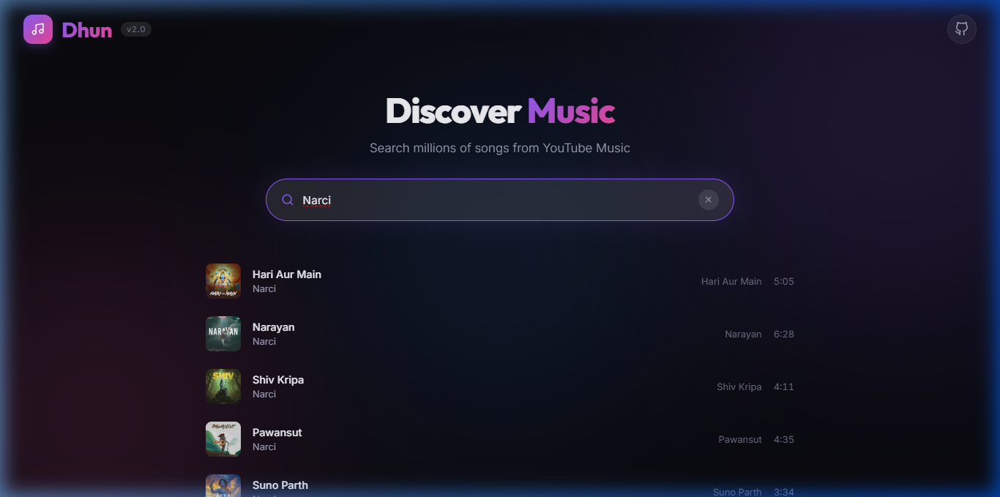
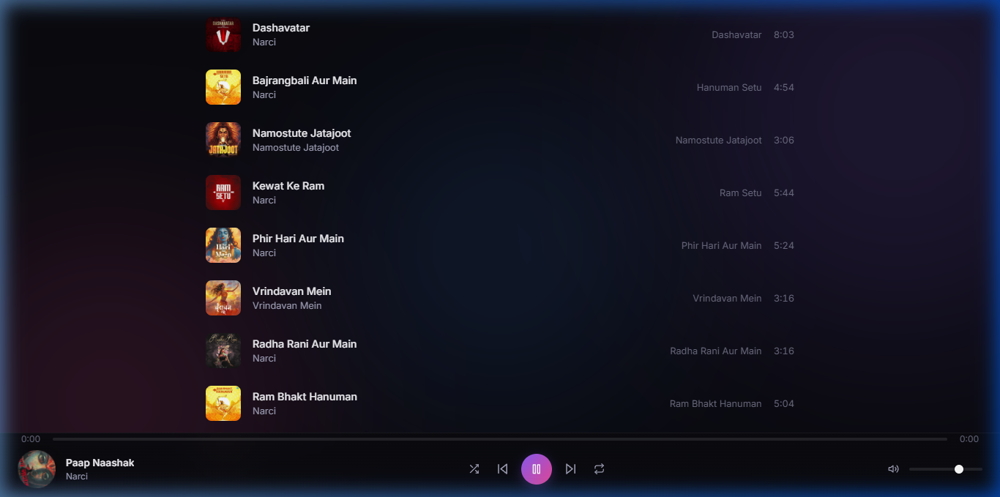
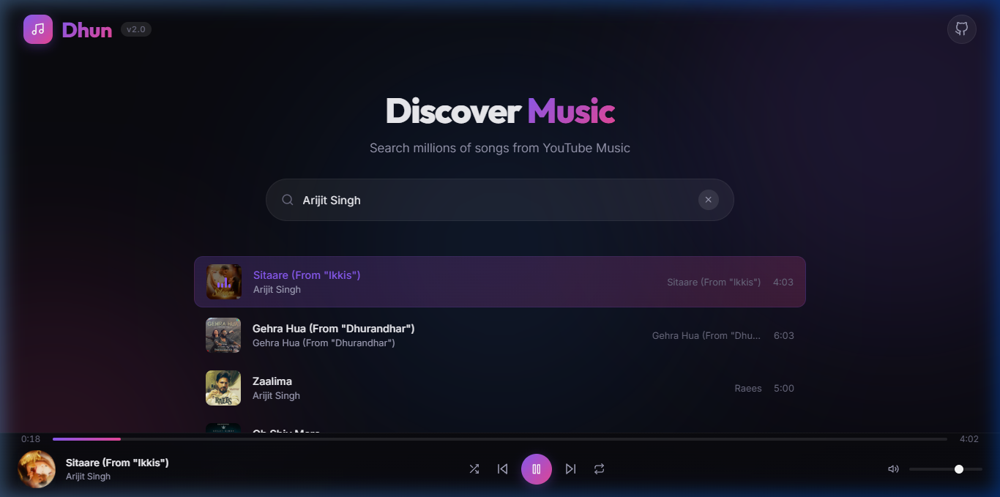

# Walkthrough: Dhun v2.0 — React + ytmusic-api

## Summary

Restructured the **Dhun** music player from vanilla HTML/CSS/JS (17 local `.mp3` files) into a full-stack **React + Express** application that searches and streams music from **YouTube Music**.

## What Was Built

### Backend (`server/`)

- Express server on port 3001 with CORS
- `ytmusic-api` integration for search, suggestions, song details, and lyrics
- Audio streaming via `youtube-dl-exec` (yt-dlp) with:
  - 3 format fallbacks × 2 URL sources for maximum reliability
  - 30-minute audio URL caching
  - Range header support for seeking
  - Proxy layer to avoid CORS issues

### Frontend (`client/`)

- React + Vite with custom dark theme design system
- Animated floating background orbs (purple/pink/blue gradients)
- Glassmorphism search bar with debounced live suggestions
- Song list with thumbnails, equalizer animation, and skeleton loading
- Fixed bottom player bar (Spotify-style) with:
  - Album art (spins while playing)
  - Play/pause, prev/next, shuffle, repeat controls
  - Gradient progress bar with time display
  - Volume slider with mute toggle
- Global state via React Context (queue, playback, volume, shuffle, repeat)

## Bug Fixes

### Audio Streaming Iterations

1. **`play-dl`** — Failed with "Invalid URL" errors (couldn't parse YouTube URLs)
2. **`@distube/ytdl-core`** — Failed with "Failed to find any playable format" (YouTube bot detection)
3. **`youtube-dl-exec` (yt-dlp)** — Works! But `addHeader` option caused Windows argument-parsing issues (spaces in User-Agent string were treated as separate CLI arguments → `'NT' is not a valid URL`)
4. **Final fix** — Removed `addHeader`, added `noPlaylist` flag, retry logic across multiple formats and URL sources

## Verification

### Build

- ✅ Frontend builds cleanly: `✓ built in 8.53s` (Vite v6.4.1)
- ✅ Backend starts: `🎵 Dhun Server running on http://localhost:3001`

### Browser Testing

- ✅ Search returns results with thumbnails, titles, artists, albums, durations
- ✅ Audio plays successfully (stream returns 206 Partial Content)
- ✅ Progress bar advances, time display works
- ✅ Player controls (play/pause, skip, shuffle, repeat, volume) functional

### Screenshots

**Search results for "Narci":**

**Player bar with active playback:**

**Arijit Singh playback working (after streaming fix):**

